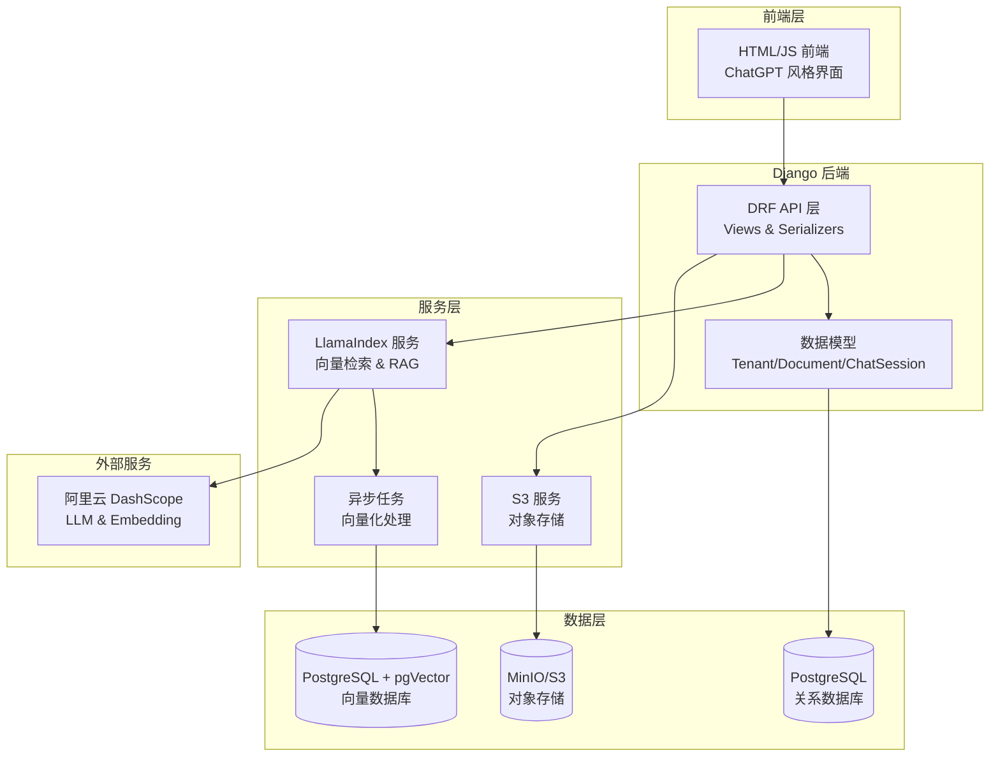
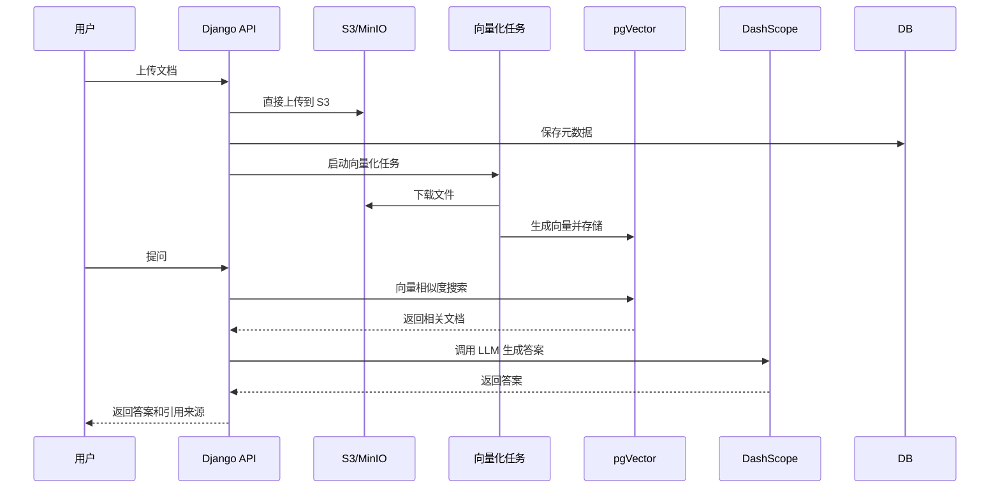
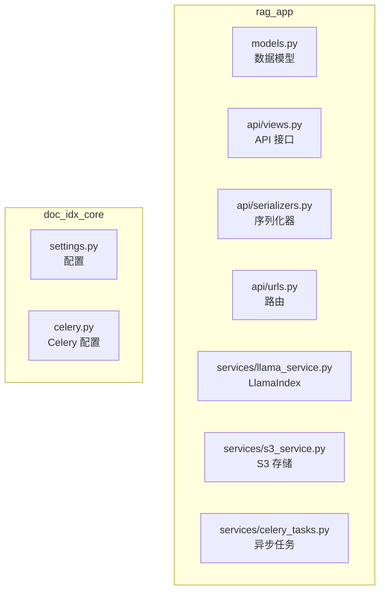

# 系统架构图

## 整体架构

```mermaid
graph TB
    subgraph 前端层
        UI[HTML/JS 前端<br/>ChatGPT 风格界面]
    end

    subgraph Django 后端
        API[DRF API 层<br/>Views & Serializers]
        Models[数据模型<br/>Tenant/Document/ChatSession]
    end

    subgraph 服务层
        LlamaSVC[LlamaIndex 服务<br/>向量检索 & RAG]
        S3SVC[S3 服务<br/>对象存储]
        Tasks[异步任务<br/>向量化处理]
    end

    subgraph 数据层
        RDB[(PostgreSQL<br/>关系数据库)]
        VecDB[(PostgreSQL + pgVector<br/>向量数据库)]
        S3[(MinIO/S3<br/>对象存储)]
    end

    subgraph 外部服务
        DashScope[阿里云 DashScope<br/>LLM & Embedding]
    end

    UI --> API
    API --> Models
    API --> LlamaSVC
    API --> S3SVC
    LlamaSVC --> Tasks
    Tasks --> VecDB
    LlamaSVC --> DashScope
    Models --> RDB
    S3SVC --> S3
```

## 数据流

```mermaid
sequenceDiagram
    participant User as 用户
    participant API as Django API
    participant S3 as S3/MinIO
    participant Task as 向量化任务
    participant VecDB as pgVector
    participant LLM as DashScope

    User->>API: 上传文档
    API->>S3: 直接上传到 S3
    API->>DB: 保存元数据
    API->>Task: 启动向量化任务

    Task->>S3: 下载文件
    Task->>VecDB: 生成向量并存储

    User->>API: 提问
    API->>VecDB: 向量相似度搜索
    VecDB-->>API: 返回相关文档

    API->>LLM: 调用 LLM 生成答案
    LLM-->>API: 返回答案
    API-->>User: 返回答案和引用来源
```

## 模块结构

```mermaid
graph TB
    subgraph rag_app
        Models[models.py<br/>数据模型]
        Views[api/views.py<br/>API 接口]
        Serializers[api/serializers.py<br/>序列化器]
        Urls[api/urls.py<br/>路由]
        LlamaService[services/llama_service.py<br/>LlamaIndex]
        S3Service[services/s3_service.py<br/>S3 存储]
        CeleryTasks[services/celery_tasks.py<br/>异步任务]
    end

    subgraph doc_idx_core
        Settings[settings.py<br/>配置]
        CeleryConfig[celery.py<br/>Celery 配置]
    end
```
